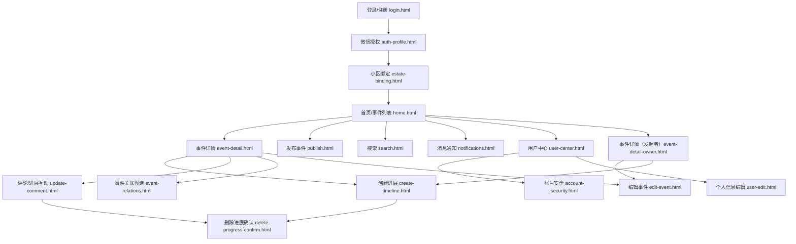

# 事件追踪器微信小程序原型


## 项目简介

【事件追踪器】是一款面向社区的微信小程序原型，支持事件的全流程追踪、进展记录与透明化管理。原型采用高保真 HTML + Tailwind CSS 实现，界面风格现代，严格遵循微信小程序设计规范，适配 iPhone 13 mini 尺寸。

## 主要特性
- 登录/注册、微信授权、社区绑定
- 事件列表、详情、进展、评论、搜索
- 事件发布、进展创建、图片上传、标签管理
- 用户中心、账号安全、个人信息编辑
- 消息通知、事件关联图谱
- 所有页面均为独立 HTML 文件，主入口 index.html 以 iframe 平铺展示

## 页面结构



## 主要页面功能说明
- **login.html**：手机号/账号登录、注册、协议勾选
- **auth-profile.html**：微信授权弹窗
- **estate-binding.html**：绑定小区
- **home.html**：事件分类、搜索、TabBar、发布入口
- **event-detail.html**：事件详情、进展、评论（普通用户视角）
- **event-detail-owner.html**：事件详情（发起者视角），含编辑、删除、邀请协作者、修改状态等操作
- **publish.html**：事件发布、图片、标签
- **create-timeline.html**：添加进展
- **update-comment.html**：评论、状态切换、删除进展
- **search.html**：关键词/标签搜索
- **notifications.html**：消息通知
- **user-center.html**：个人中心、资料、账号安全
- **account-security.html**：用户名/密码修改
- **user-edit.html**：编辑个人信息
- **event-relations.html**：事件关联图谱
- **delete-progress-confirm.html**：删除进展确认
- **edit-event.html**：编辑事件，表单预填充，支持二次修改与保存

## 技术栈与设计规范
- HTML5 + Tailwind CSS + FontAwesome
- 现代化 UI，圆角、状态栏、底部导航栏
- 图片资源来自 Unsplash/Pexels/Apple 官方
- 严格遵循微信小程序 iOS/Android 设计规范

## 目录结构
```
├── index.html                # 主入口，iframe 平铺所有页面
├── home.html                 # 首页/事件列表
├── login.html                # 登录/注册
├── auth-profile.html         # 微信授权
├── estate-binding.html       # 小区绑定
├── event-detail.html         # 事件详情（普通用户）
├── event-detail-owner.html   # 事件详情（发起者视角），含邀请编辑等
├── publish.html              # 发布事件
├── create-timeline.html      # 创建进展
├── update-comment.html       # 评论/进展互动
├── search.html               # 搜索
├── notifications.html        # 消息通知
├── user-center.html          # 用户中心
├── account-security.html     # 账号安全
├── user-edit.html            # 个人信息编辑
├── event-relations.html      # 事件关联图谱
├── delete-progress-confirm.html # 删除进展确认
├── edit-event.html           # 编辑事件（表单预填充，二次编辑）
├── assets/                   # 静态资源（图片、样式等）
```

## 预览方式
1. 使用现代浏览器（推荐 Chrome）打开 `index.html`，即可预览全部原型页面。
2. 所有页面均为静态 HTML，无需后端环境。


## 更新日志
- 2024-06-09：
  - [publish.html] 发布事件页面新增"事件开始时间"卡片，支持用户录入事件的开始时间。
  - [create-timeline.html] 创建新进展页面新增"进展开始时间"卡片，支持用户录入进展的开始时间。
  - [edit-event.html] 新增编辑事件页面，支持事件内容的二次编辑与保存，event-detail.html 菜单增加"编辑"入口。
  - [event-detail.html] 修改为普通用户视角，移除事件操作菜单。
  - [event-detail-owner.html] 新增事件发起者视角详情页，支持邀请协作者、编辑事件、删除事件等操作。