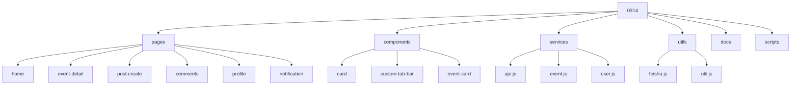
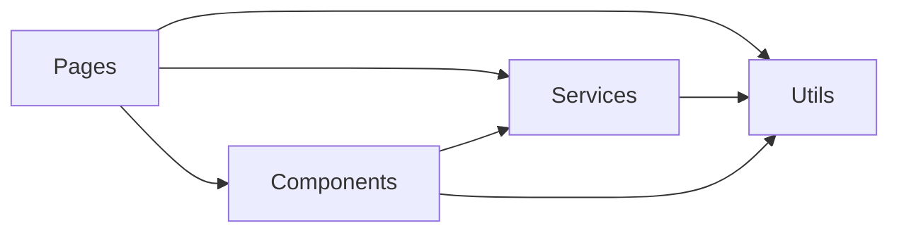
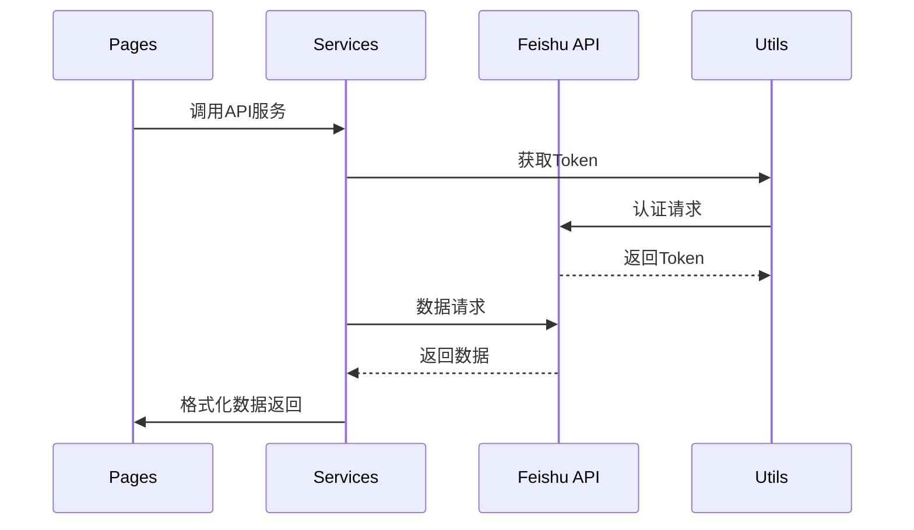
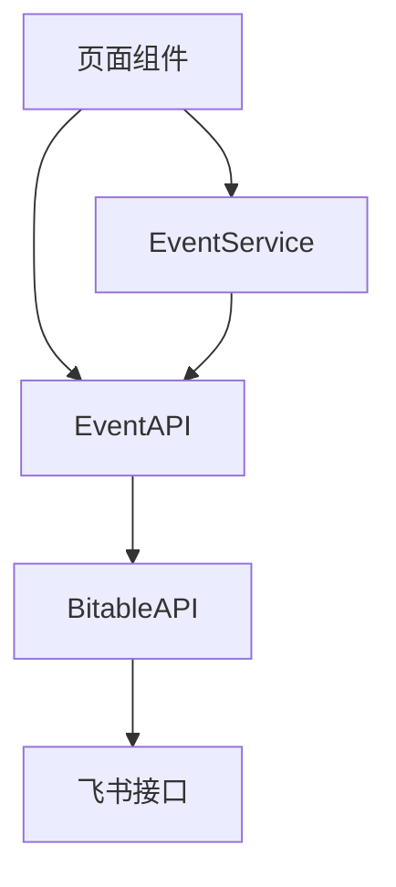
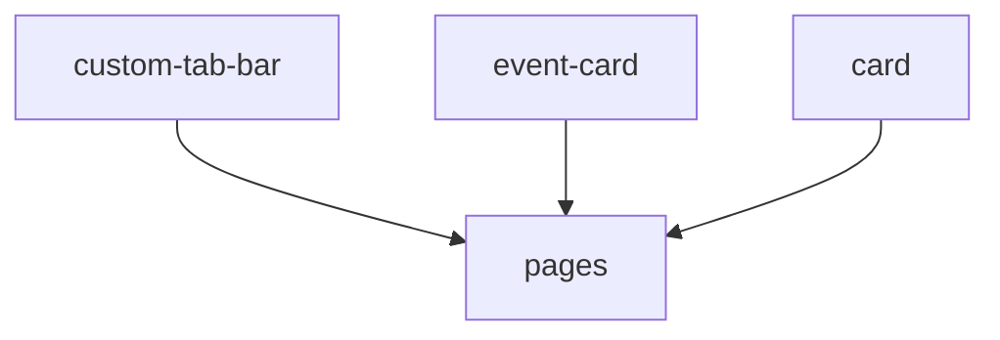

# 项目架构文档

## 目录结构

## 核心模块依赖关系

## 主要功能流程

## 关键文件索引

| 文件路径 | 主要功能 | 关键依赖 |
|---------|---------|----------|
| services/api.js | API接口封装 | feishu.js |
| services/event.js | 事件相关业务逻辑 | api.js, util.js |
| utils/feishu.js | 飞书API调用封装 | - |
| utils/util.js | 通用工具函数 | - |
| pages/home/index.js | 首页逻辑 | api.js, util.js |
| components/event-card | 事件卡片组件 | api.js |

## 数据流向

## API调用层级

## 组件通信

